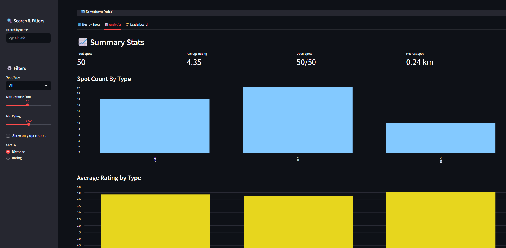
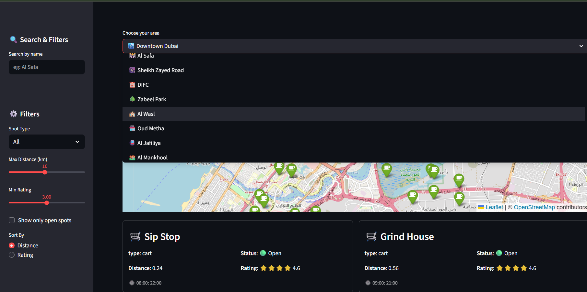
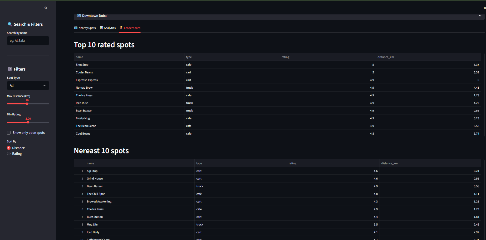
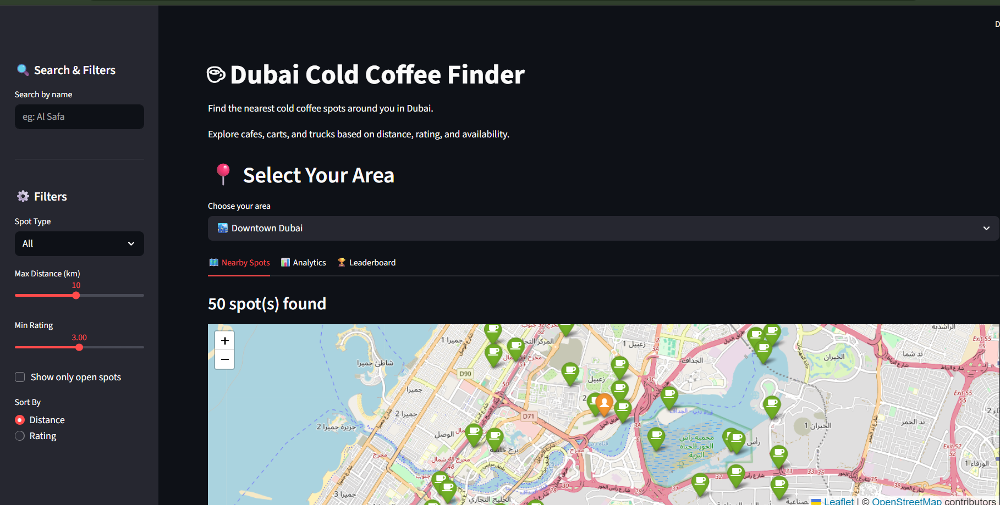

## 🌐 Live Demo
👉 Try the app here:  
https://dubai-coffee-finder-nmdppwn9thht5pqjtkhrmq.streamlit.app/

Dubai Coffee Finder
Overview
Dubai Coffee Finder is a Streamlit-based web application that helps users discover coffee spots in Dubai using location filtering, nearby recommendations, maps, and analytics.

Features
Find nearby coffee spots
View coffee locations on map
Analytics dashboard with graphs
Leaderboard of coffee spots
Easy-to-use interface

Technologies Used
Python
Streamlit
Pandas
NumPy
Geopy

Project Structure
Dubai Coffee Finder/
dubai_web_app.py → Main application
helper/utils.py → Helper functions
CSV files → Dataset
screenshots/ → Application images
README.md → Project documentation

How to Run
Open terminal inside project folder
pip install -r requirements.txt

## 📸 Screenshots

### 📊 Analytics Dashboard

### 🏠 Homepage

### 🏆 Leaderboard

### 🗺️ Map View

